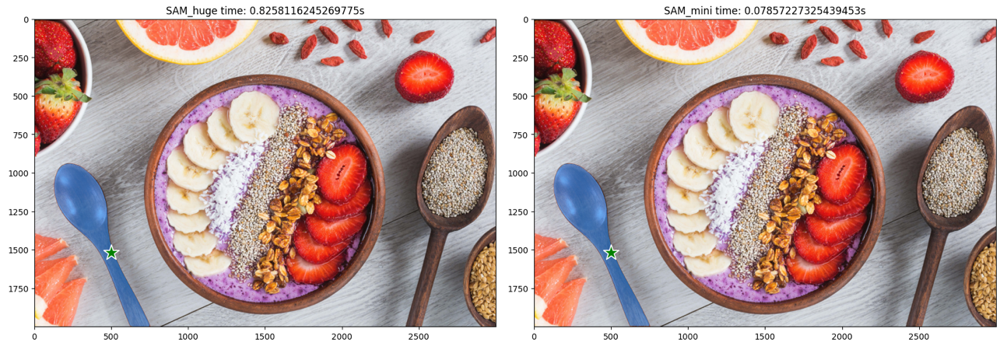
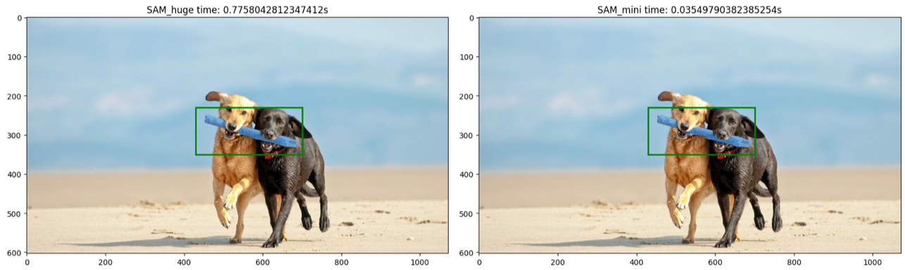
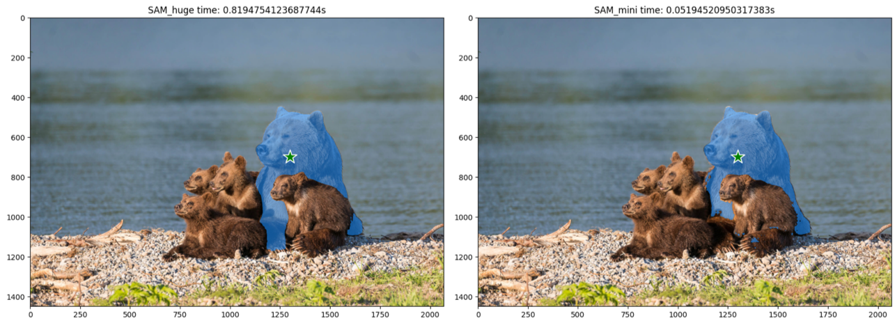
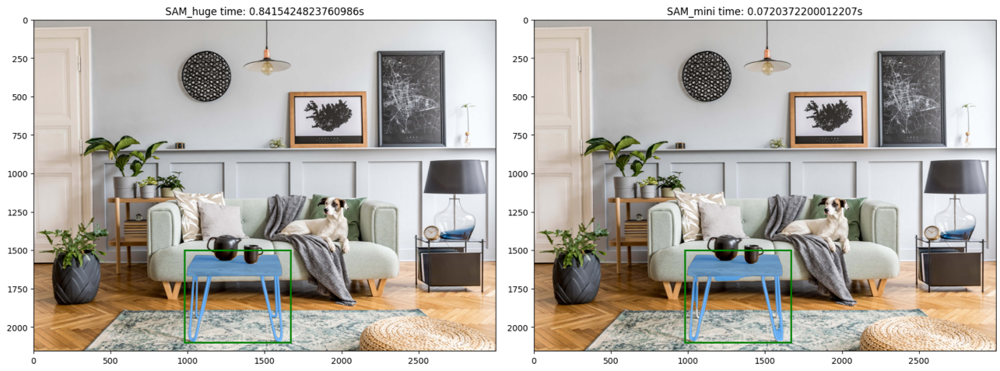

In this repo, we distill the powerful [segment anything](https://github.com/facebookresearch/segment-anything) models into lightweight [yoso](https://github.com/hujiecpp/YOSO) models for efficient image segmentation (yoso is a framework aiming to achieve real-time panoptic segmentation).
Specifically, we replace the heavy ViT image encoder with yoso image encoder.
This provides over 10 times speedup for extracting image features with a single RTX 3090 GPU.
Currently, we release demo checkpoints here, and will update them when we obtain more accurate ones.


## Examples
- Good segmentation results



- Bad segmentation results



## Getting Started
### Installation
We recommend to use [Anaconda](https://www.anaconda.com/) for installation.
```bash
conda create --name sam_mini python=3.8 -y
conda install pytorch==1.10.1 torchvision==0.11.2 cudatoolkit=11.3 -c pytorch
pip install git+https://github.com/facebookresearch/detectron2.git
pip install git+https://github.com/facebookresearch/segment-anything.git
pip install opencv-python pycocotools matplotlib
```

### Checkpoints
- 2023/04/27: [sam_yoso_r50_13a999.pth](https://github.com/hujiecpp/Mini-Segment-Anything/releases/download/checkpoint/sam_yoso_r50_13a999.pth)


### Demos
After loading the lightweight model, the remaining operations keep the same as segment anything.
- Predictor:
```python
from mini_segment_anything import build_sam_yoso_r50
from segment_anything import SamPredictor

sam_checkpoint = './sam_yoso_r50_13a999.pth'
sam_mini = build_sam_yoso_r50(checkpoint=sam_checkpoint).to('cuda')
predictor_mini = SamPredictor(sam_mini)
```

- Automatic mask generator:
```python
from mini_segment_anything import build_sam_yoso_r50
from segment_anything import SamAutomaticMaskGenerator

sam_checkpoint = './sam_yoso_r50_13a999.pth'
sam_mini = build_sam_yoso_r50(checkpoint=sam_checkpoint).to('cuda')
mask_generator_mini = SamAutomaticMaskGenerator(sam_mini)
```
More details can be found in './demo.ipynb'.

## Todo List
- [x] Distill with image encoder.
- [ ] Distill with mask decoder.

## Citation

If you find this project helpful for your research, please consider citing the following BibTeX entry.

```BibTeX
@article{kirillov2023segany,
  title={Segment Anything}, 
  author={Kirillov, Alexander and Mintun, Eric and Ravi, Nikhila and Mao, Hanzi and Rolland, Chloe and Gustafson, Laura and Xiao, Tete and Whitehead, Spencer and Berg, Alexander C. and Lo, Wan-Yen and Doll{\'a}r, Piotr and Girshick, Ross},
  journal={arXiv:2304.02643},
  year={2023}
}

@article{hu2023yoso,
  title={You Only Segment Once: Towards Real-Time Panoptic Segmentation},
  author={Hu, Jie and Huang, Linyan and Ren, Tianhe and Zhang, Shengchuan and Ji, Rongrong and Cao, Liujuan},
  journal={arXiv preprint arXiv:2303.14651},
  year={2023}
}
```
